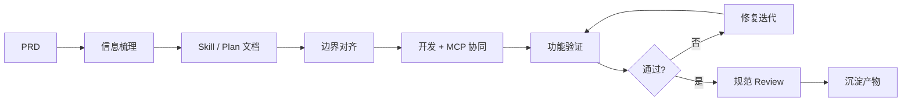

# AI Native 前端开发工作法

> 一份给团队前端同事的实操手册：不讲"AI 是什么"，只讲"怎么用 AI 把活干漂亮"。

---

## 块 1 · 心智模型

> **一句话**：AI Native 不是让 AI 替你写代码，而是让 AI 接管「理解 → 设计 → 执行 → 验证」的全链路，你做边界与品味的把关者。

### 传统 vs AI Native

| 维度 | 传统流程 | AI Native 流程 |
| --- | --- | --- |
| 起点 | 拿到 PRD 直接动手写代码 | 拿到 PRD 先让 AI 做信息抽取 + 出开发文档 |
| 设计 | 脑内构思 / 口头对齐 | Plan 文档作为可被审阅的中间产物 |
| 执行 | 人写每一行 | AI 按 Plan 执行，人 review diff |
| 验证 | 自己点页面 | AI 跑起来 + 人看真实页面 + AI 自审 diff |
| 质量门控 | 集中在 Code Review | 分散到每一阶段（Plan / 边界 / Diff / 规范 / 沉淀） |
| 复用资产 | 代码片段、wiki 散文 | Skill 文档、Prompt 模板、MCP 配置 |

### 四条核心原则

1. **Plan First**：动手前先有 Plan 文档；Plan 没说清的，代码就一定写不对。
2. **边界清晰**：每次任务先声明改动级别 + 触碰文件清单，AI 不许越界。
3. **双向验证**：AI 自审 diff + 人看真实页面，两条腿都要落地。
4. **沉淀复用**：每完成一个任务，问自己：「这次的 prompt / skill / 反例」要不要进资产库？

> ⚡ **Skill 文档分两层**：项目级（[DEVSKILL.md](../DEVSKILL.md)，整个仓库的宪法）+ 模块级（[docs/draft/draft.md](./draft/draft.md)，单模块的接入规范）。两层都备齐，AI 才能按图索骥写出符合项目品味的代码。

---

## 块 2 · 工作法主线

> **一句话**：七步流程的关键不在"步多"，在每一步都有清晰的输入和产出，让 AI 不掉链子。

### 流程总览



### 七步四要素表

| 步骤 | 输入 | 动作 | 产出 | 卡点信号 |
| --- | --- | --- | --- | --- |
| 1. PRD 解析 | 产品 PRD / 设计稿 | 让 AI 抽功能边界、数据流、状态点、异常路径 | 结构化需求清单 | AI 输出含"大概""可能" → PRD 不够清晰 |
| 2. 信息梳理 | 需求清单 | 标注"已有可复用 / 需要新建" | 复用候选列表 | 找不到复用 → 多半没读够代码 |
| 3. 出 Skill 文档 | 需求清单 + 项目规范 | 让 AI 出分层设计与文件清单 | Plan / Skill md | 步骤超过 10 步 → 拆任务 |
| 4. 边界对齐 | Plan 文档 | 声明改动级别 + 触碰文件清单 | 边界声明 | 触碰文件 > 10 → 拆 PR |
| 5. 开发执行 | 边界声明 + Plan | AI 按规范写代码，必要时调 MCP | 代码 diff + 修改清单 | diff 含未声明文件 → 立刻 stop |
| 6. 验证 | 代码 + 真实环境 | 跑起来 + AI 自审 + 人验收 | 验证报告 | 复现不了 bug → 优先补复现路径 |
| 7. Review & 沉淀 | 通过验证的 diff | 对照规范 review，提取可复用片段 | 合并 PR + 资产更新 | 没沉淀 → 下次还得重写 prompt |

### 关于工具

文中所有"AI"指你手上的 AI 编程工具（Claude Code / Codex / 其他）。流程不挑工具，**挑工作法**。同一个 prompt 在不同工具下的差异远小于"有没有 prompt"的差异。

---

## 块 3 · 阶段实操

> **一句话**：四个高价值阶段各配 1 个可复制 prompt，把"靠感觉"变成"靠模板"。

### 3.1 PRD → Skill 文档

**目的**：把 PRD 这种"人话文档"转成 AI 能精确执行的"结构化指令"。

**关键动作**：
- 抽取**功能边界**（做什么 / 不做什么）
- 抽取**数据流**（前端状态、接口入参出参、跨页面传值）
- 列**状态点**（loading / empty / error / success / 权限态）
- 列**异常路径**（接口失败 / 参数缺失 / 鉴权过期）
- 标**复用候选**（项目里已有的组件、store、service）

> 用途：从 PRD 抽取结构化开发信息

```text
你是当前项目的资深前端架构师。请阅读下面的 PRD，并按以下结构输出（不要写代码）：

1. 功能边界
   - 必须实现的核心能力（条目化）
   - 明确不在本期范围的能力（条目化）
2. 数据流
   - 前端状态：哪些字段、谁拥有
   - 后端接口：方法 / 路径 / 入参 / 出参（PRD 没写的标【需澄清】）
3. 状态点
   - loading / empty / error / success / 权限不足 各自的 UI 表现
4. 异常路径
   - 列出所有可能失败的环节及兜底策略
5. 复用候选
   - 在项目中查找是否已有可复用的：组件 / store / service / 工具函数
   - 给出文件路径，无则写"未找到"

PRD：
"""
<在这里粘贴 PRD>
"""
```

**反例**：把 PRD 丢给 AI 直接说"实现一下"。结果一定是 AI 自己脑补需求，写出 70% 对、30% 错的代码，review 时全是返工。

**项目内的"项目级 Skill 文档"标杆**：[DEVSKILL.md](../DEVSKILL.md) —— 它本身就是给 AI 看的项目宪法（分层、命名、允许 / 禁止）。每次让 AI 干活前，告诉它"严格遵循 DEVSKILL.md"。

---

### 3.2 边界定义与改动级别

**目的**：开工前圈地。圈得越清晰，AI 越不容易越界，review 越快。

**三档改动级别**：

| 级别 | 含义 | AI 授权 | 典型场景 |
| --- | --- | --- | --- |
| L1 隔离新增 | 仅新增文件，不改老代码 | 自由发挥 | 新增 feature、新增组件、新增工具函数 |
| L2 局部增强 | 改动 1-3 个老文件，不改公共抽象 | 必须先列清单再动手 | 给老页面加按钮、给 store 加字段 |
| L3 跨模块改造 | 涉及公共组件 / shared / 路由 | 必须出 Plan，分 PR | 改 Layout、改 request 拦截器 |

> 用途：开发启动前强制 AI 声明边界

```text
任务：<一句话需求>
改动级别：L1 / L2 / L3（三选一）

请在动手前先输出：
1. 即将创建的文件路径列表
2. 即将修改的文件路径列表 + 每个文件的改动要点（一行一句）
3. 不会触碰的相邻代码（明确说"不改 X，因为 Y"）
4. 风险点：可能会破坏的现有功能

我确认无误后再说"OK，开始"，你才可以写代码。
不要先写代码再补声明。
```

**配套规则**：AI 写完后，让它把"实际触碰的文件清单"再贴一次，跟事前声明对账。多一个少一个都要解释。

---

### 3.3 开发与 MCP 协同

**目的**：让 AI 在"知道项目长什么样"的状态下写代码，而不是在真空里编。

**MCP 用法（按本项目可用的列）**：

| MCP | 何时用 | 怎么用 |
| --- | --- | --- |
| Figma | 实现新页面 / 还原设计稿 | 给 AI Figma 链接，让它先 `get_design_context` 拿规格、tokens、组件，再下笔 |
| Context7 | 用到某个库的新 API / 不确定语法 | 让 AI 先查文档再写，避免幻觉 API |
| Pencil | 项目内 .pen 设计稿 | 通过 MCP 读，不要 Read 文件 |

**协同原则**：
- ✅ 让 AI 主动联网：第三方库新版本、设计稿规格、不确定的 API 行为
- ❌ 禁止 AI 联网：业务规则、内部接口约定、PRD 解读 —— 这些只能来自你给的上下文

> 用途：开发过程中要求 AI 同步产出修改清单与影响面

```text
按 Plan 实现这个任务。每完成一个文件的修改，立即在回复里追加一段：

[修改记录]
- 文件：<路径>
- 类型：新增 / 修改 / 删除
- 关键改动：<一句话>
- 影响面：哪些页面 / 组件 / 调用方会受影响

整个任务结束时，把所有 [修改记录] 汇总成一张表，并指出是否有超出最初边界声明的改动。
```

---

### 3.4 验证与修复

**目的**：让"通过验证"变成可观察事件，而不是"我觉得应该没问题"。

**双向验证**：

1. **跑起来看页面**：dev server 起来，过一遍主流程 + 至少 1 个边缘场景（空数据、网络失败、权限不足）
2. **AI 自审 diff**：让 AI 对照 [DEVSKILL.md](../DEVSKILL.md) 把自己的代码挑一遍刺

> 用途：bug 复现 → 二分定位 → 最小修复

```text
现象：<具体描述：什么操作后 → 看到什么 → 期望什么>
复现路径：<步骤 1 / 2 / 3>
环境：<浏览器 / 账号 / 数据>

请按以下顺序处理：
1. 先复现该 bug 的最小可执行路径（不要急着改代码）
2. 提出 2 个最可能的根因假设，按可能性排序
3. 选最可能的那个，给出**最小**修复 diff（只动必须动的代码，不要顺手重构）
4. 解释为什么这个修复不会引入回归
5. 列出建议人工二次验证的 3 个场景

如果 1 步就复现不了 bug，停下来跟我要更多信息，不要硬猜。
```

> 用途：guard —— 防止 AI 偷偷扩大改动

```text
你刚才的 diff 中，有没有任何修改是不属于本次 bug 修复必需的？
（包括：顺手重命名、顺手抽函数、顺手补 import、顺手改格式）
如果有，请回滚到只保留必需修改的版本。
```

---

## 块 4 · 案例演练：在创作工具下接入一个新 tool_type

> **一句话**：用项目里真实存在的"创作工具接入规范"（[docs/draft/draft.md](./draft/draft.md)）做底，演示 AI Native 工作法在一个**有完整模块级 skill** 的场景下如何高效落地。

### 场景设定

> 在 [features/creation-tools/](../src/features/creation-tools/) 下接入一个新的 `tool_type`（业务细节虚化，假定为 `your_tool`）。模块已有两个参考工具：服装上身（`clothing_tryon`）、图片翻译（`image_translate`），且已沉淀完整的接入文档 [draft.md](./draft/draft.md)。

### 这个案例的关键看点

这个模块的"AI Native 收益"不在写代码本身，而在**工作法的复利**：

- **模块级 skill 已沉淀**：架构总览、目录结构、需求确认门禁、接入 8 步、云控契约、自检表、Review 清单 —— [draft.md](./draft/draft.md) 全有
- **AI 只要"读懂规范 + 按规范执行"**：人不再当翻译，AI 不再当算命先生
- **每接入一个新工具，都在打磨这份规范**：发现新坑就回写到 draft.md，下一个工具更便宜

### Step 1 · 需求确认（卡住门禁）

[draft.md §5](./draft/draft.md) 已经定好了**门禁四件套**：`tool_type` / 工具名称 / 云控 CMS key+value / 编辑区 Figma 链接（含 node-id）。缺一不能动手。

直接复用文档里的话术模板（draft.md §5.2），把它丢给 AI 让它按这个格式跟你来回确认。

> 用途：让 AI 当门禁守卫，未确认完不许写代码

```text
你的角色是 creation-tools 模块的接入助手。请严格按照 docs/draft/draft.md §5
的门禁要求，跟我确认四项信息：tool_type / 工具名称 / 云控 CMS key 与 value 草案 / 编辑区 Figma 链接。

规则：
- 任一项缺失或含糊（例如 tool_type 不是 snake_case、Figma 没有 node-id、value 是空 JSON），
  回复"缺 X，请补充 Y"，不要继续。
- 所有四项都明确后，输出一份"§5.6 确认完成检查"表，等我说"OK"才进入 §6 接入。
- 不要自己脑补任何业务字段。
```

### Step 2 · 边界声明（套用模块白名单）

[draft.md §15.3](./draft/draft.md) 把"模块内允许新增"和"模块外白名单"写得非常清楚。这一步不再需要 P2 通用模板，而是用**模块定制版**。

> 用途：基于 draft.md §15.3 的白名单做边界声明

```text
按 docs/draft/draft.md §6 的接入步骤接入 your_tool。在写任何代码前先输出：

A. 模块内新增文件清单（应落在 src/features/creation-tools/ 下）
   - domain/yourTool/ 下五个文件（types/config/buildSubmitParams/hydrateEditor/index）
   - ui/editor/YourToolEditorPanel.tsx
   - ui/editor/components/* （工具专属交互组件，列名）
B. 模块内追加注册（不新增文件，仅追加）
   - services/types.ts 中 CREATION_TOOL_TYPES 追加项
   - domain/common/toolRegistry.ts 中 CREATION_TOOL_REGISTRY 追加条目
   - ui/editor/ToolEditorPanel.tsx 中 TOOL_EDITOR_REGISTRY 追加条目
C. 模块外允许的改动（参照 §15.3.2 白名单）
   - 仅 features/video-generation/types/generationApi.ts 的 GenerationRequestKwargs 追加可选字段（如有）
D. 不会触碰的位置（声明）
   - router/index.tsx（路由已通配）
   - 已有工具 Panel/domain（§15.5.0 红线）
   - GenerateResult、home 等模块（§15.3.3 越界反例）

我确认无误后才能写代码。
```

### Step 3 · 分层落地（让 AI 按四件套交付）

draft.md §6 的接入步骤本身就是 AI 的工作清单。

```text
按 docs/draft/draft.md §6 的 Step 1~8 执行：
- Step 1 注册 CREATION_TOOL_TYPES
- Step 2 在 toolRegistry 注册四件套：cmsKey / adaptConfig / hydrateEditor / buildSubmitParams
- Step 3 新建 domain/yourTool/ 五个文件
- Step 4 common 分发（应无需新增分支，§15.4 红线：禁止在 hydrateToolEditor / cloudConfig/index 写 if/else）
- Step 5 新建 Panel + 注册 TOOL_EDITOR_REGISTRY
- Step 6 结果区不改
- Step 7 GenerationRequestKwargs 按需扩展
- Step 8 路由不改

实现时严格遵循：
1. DEVSKILL.md 的分层架构与 observer 模式
2. draft.md §2 的设计原则（tool_type 唯一标识 / 公共字段走 common / 禁止混写 if(toolType) 业务）
3. 参考已有的 clothingTryOn 与 imageTransform 两套 domain 实现风格

每实现一个文件，追加一段 [修改记录]（用 P3 prompt 格式）。
```

### Step 4 · 验证（链路 + 自检）

draft.md §11 的"链路自检"已经替你列好了 6 个必过场景：

- 编辑页云控加载（无数据走空态，**禁止 fallbacks 兜底** —— §15.8 红线）
- 首次生成 → 结果区出现任务
- 结果区空状态（视频 / 多图轮播）
- 重新编辑 → 编辑区回填
- 再次生成 / 失败重试
- `pnpm tsc --noEmit` 无新增错误

> 用途：让 AI 按 draft.md 链路项做自检

```text
对照 docs/draft/draft.md §11 链路自检 + §15.4 架构约束 + §15.8 云控缺失行为，
逐项核对刚才的 diff，输出：
- 每条勾 / 叉 + 文件:行号
- 任何叉项给出最小修复方案（不要顺手重构，遵守 P5 guard）
- 特别确认：是否新增了 fallbacks.ts 或硬编码业务数据（§15.8 红线，必为否）
```

### Step 5 · Review（直接套模板）

draft.md §15.10 已经写好了 PR 描述模板，让 AI 填即可。

```text
按 docs/draft/draft.md §15.10 的"Review 结论模板"格式，
基于这次实际改动填一份 PR 描述。所有勾项必须有事实依据（贴文件名 / 命令输出）。
```

### Step 6 · 沉淀

接入完成后，问三个问题（每个回答 yes 都要回写 draft.md）：

1. 这次有没有踩到 draft.md **没覆盖**的坑？→ 加进 §12「常见注意点」
2. 有没有遇到 AI **照规范也写错**的地方？→ 在 §15 的对应小节补一条 Review 检查项
3. 这次的提交参数 / 云控字段，跟 §10 已有两个工具差异表对得上吗？→ 在差异表加一列

> 这是 AI Native 工作法的复利来源：每接入一个新工具，模块级 skill 就更厚一点，下一个工具的边际成本就更低一点。

---

## 块 5 · 沉淀与复用资产

> **一句话**：单次任务的产出沉淀成"下次任务的起点"，AI 协作的复利就在这里。

### Prompt 模板清单

| 编号 | 用途 | 出现位置 |
| --- | --- | --- |
| P1 | 从 PRD 抽取结构化信息 | 3.1 |
| P2 | 开发前边界声明 | 3.2 |
| P3 | 开发中产出修改清单 | 3.3 |
| P4 | bug 复现 + 二分定位 + 最小修复 | 3.4 |
| P5 | guard：防止 AI 偷偷扩大改动 | 3.4 |
| P6 | 自审：对照 DEVSKILL 检查 diff | 4 / Step 5 |

把这 6 个 prompt 存成片段，每次开工前粘贴，比现写省一半时间。

### Skill 文档清单（按层级）

| 层级 | 内容 | 在哪 |
| --- | --- | --- |
| 项目级 | 分层架构、命名、允许 / 禁止、分层职责 | [DEVSKILL.md](../DEVSKILL.md) |
| 模块级 | 单个 feature 的接入规范、需求确认门禁、自检 + Review 清单 | [docs/draft/draft.md](./draft/draft.md)（创作工具接入文档，标杆样本）<br>feature 内 README，如 [creation-tools/README.md](../src/features/creation-tools/README.md)、[TOOL_TYPE_INTEGRATION_GUIDE.md](../src/features/creation-tools/TOOL_TYPE_INTEGRATION_GUIDE.md) |
| 个人级 | 你常用的 prompt、习惯、口令 | 个人笔记 / `~/.claude/` |
| 团队级 | review checklist、避坑清单 | 团队 wiki / 本文档 |

> **模块级 skill 是 AI Native 的高复利产物**：[draft.md](./draft/draft.md) 这种规范一旦成型，每个新 tool_type 接入都把它当宪法 + 检查清单用，AI 不用每次重新理解模块，新人也能用同一份文档上手。

### MCP 工具清单（项目可用）

| 名称 | 干什么 | 关键场景 |
| --- | --- | --- |
| Figma | 读设计稿、生成代码、code-connect | 还原视觉、对接 design tokens |
| Context7 | 拉第三方库最新文档 | 防止 AI 幻觉 API |
| Pencil | 读 .pen 设计文件 | 项目专属设计源 |

### 避坑清单（AI 写出的常见反模式）

按 [DEVSKILL.md](../DEVSKILL.md) 红线归纳，让 AI 自查时照着对：

- ❌ ui/ 里直接 `import request` 调 API → 应走 service
- ❌ store 内直接 `request.get` → 绕开 service 层
- ❌ 在组件里直接赋值 `store.xx = ...` → 应走 action
- ❌ 写一层"包 store 的 hooks" → 过度设计，直接用 observer
- ❌ domain 函数里调 `message.error` → 副作用应留在 service
- ❌ 跨 feature 互相 import store → 循环依赖，提到 shared 或重新设计
- ❌ 把临时状态塞进 `shared/stores` → 只有真正全局的才进 shared
- ❌ 顺手重构无关代码 → 用 P5 prompt 拦住

**模块级红线示例**（来自 [draft.md](./draft/draft.md) 创作工具模块，AI 接入新 `tool_type` 时高频踩坑）：

- ❌ 在单个 Panel 里写 `if (toolType === 'A') ... else ...` → 应拆独立 Panel + 独立 domain（§2.4）
- ❌ 云控为空时新建 `fallbacks.ts` 硬编码兜底 → 没数据就空态或禁用（§15.8 红线）
- ❌ 新增工具时改 `router/index.tsx` → 路由已通配，不许改（§15.3.2）
- ❌ 在 `ToolEditorResultPanel` 按工具写空状态分支 → 统一走云控 `emptyState`（§12.1）
- ❌ 未经用户确认就改已有工具 Panel / domain → §15.5.0 红线，须先确认
- ❌ 在 `hydrateToolEditor` / `cloudConfig/index` 写 `if/else` 分支 → 应表驱动注册到 `toolRegistry`（§15.4）

> 这些"模块级反模式"无法靠项目级 DEVSKILL 拦住，必须靠模块级 skill 文档喂给 AI。

### 效率自评维度

不必追求精确数字，定期自评以下 5 项是否在变好：

1. **一次通过率**：AI 第一次产出的代码，需返工的比例
2. **边界违规率**：实际改动 vs 事前声明的偏差次数
3. **复用命中率**：每次任务平均复用了多少已有资产
4. **PR 阅读时长**：reviewer 看完 diff 的时间
5. **资产新增数**：每周新增多少 prompt / skill / 反例进库

---

## 附：一键开工清单

每次拿到新需求，照着走：

- [ ] 看是否有现成模块级 skill（如接 creation-tools 新工具看 [draft.md](./draft/draft.md)），有就直接套门禁
- [ ] PRD 用 P1 prompt 抽一遍
- [ ] 找复用：先 grep / 看 features/ 与 shared/ui，再写新代码
- [ ] 用 P2 prompt 声明边界（有模块级文档就用模块定制版）
- [ ] 让 AI 严格按 [DEVSKILL.md](../DEVSKILL.md) + 模块级 skill 实现，参考 [video-generation](../src/features/video-generation/) 的分层
- [ ] 用 P3 prompt 让 AI 边写边交修改清单
- [ ] 跑起来过主流程 + 边缘场景（有模块自检表就照着跑）
- [ ] 用 P6 prompt 让 AI 自审
- [ ] 用 P5 prompt 卡住额外改动
- [ ] 把可复用的片段升格为资产，**新坑回写到模块级 skill**

---

**版本**：v1.0  
**适用项目**：nami-video-web (React 18 + TS 5.6 + Vite 6 + MobX 6 + Antd 6 + TailwindCSS)  
**配套规范**：[DEVSKILL.md](../DEVSKILL.md)
